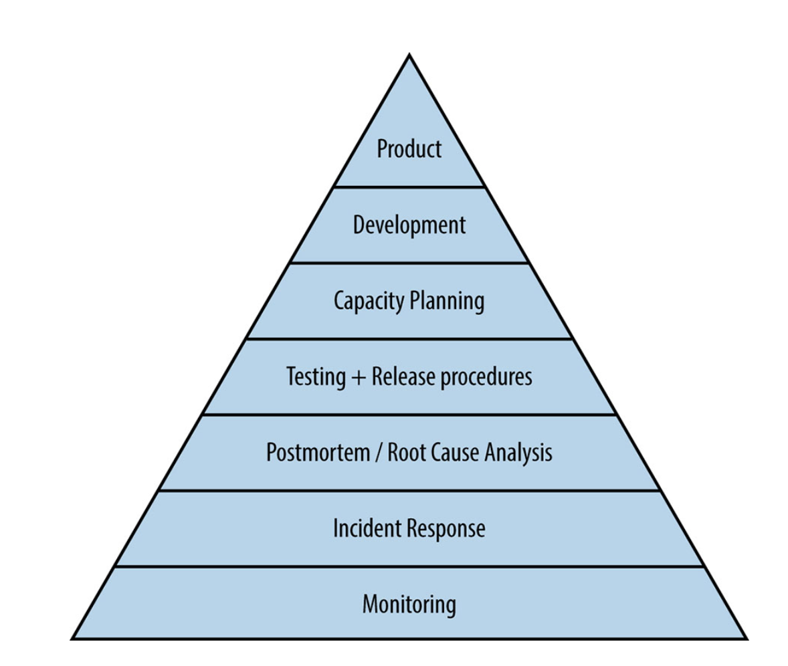

# Motivation



# Design Overview


# Sauron - Distributed Monitoring System


**What is Distributed ?**
----------------

It's an in house project  [sauron](https://tr.wikipedia.org/wiki/Sauron), providing in-depth knowledge about building microservices using [.NET Core](https://www.microsoft.com/net/learn/get-started-with-dotnet-tutorial), [python](https://www.python.org/) and [golang](https://go.dev/) framework and variety of tools. One of the goals, was to create a cloud agnostic solution, that you shall be able to run anywhere. Or you can reach out to tutorial from [udacity](https://classroom.udacity.com/courses/ud615) . And you can visit [fundamentals of computer sciences](https://www.youtube.com/watch?v=tpIctyqH29Q&list=PL8dPuuaLjXtNlUrzyH5r6jN9ulIgZBpdo)

**What topics will be discussed?**
----------------

A lot of them, covering different aspects of building distributed services, whether it comes to implementing the code, managing services discovery and load balancing, configuring logging or monitoring, and eventually deploying to the VM using Docker.

Just to name a few:
- [RESTful API](https://www.restapitutorial.com) implementation with [ASP.NET Core](https://docs.microsoft.com/en-us/aspnet/core/?view=aspnetcore-2.2)
- [Consumers](https://github.com/bilalislam/torc) implementation with [Golang](https://go.dev/)
- [UI](https://www.fullstackpython.com/flask.html) implementation with [Flask](https://www.fullstackpython.com/flask.html)
- [Tnmon SIEM](https://en.wikipedia.org/wiki/Security_information_and_event_management) implementation with [React](https://github.com/facebook/react)
- [Domain Driven Design](http://dddcommunity.org) fundamentals
- SQL and NoSQL databases ([SQL Server](https://www.microsoft.com/en-us/sql-server/sql-server-2017), , [InfluxDB](https://www.influxdata.com))
- Distributed caching with [Redis](https://redis.io)
- [CQRS](https://martinfowler.com/bliki/CQRS.html), Commands, Queries & Events handlers
- Using [RabbitMQ](https://www.rabbitmq.com) as a message queue
- Dealing with asynchronous requests, Process Managers and Sagas
- Monitoring with [App Metrics](https://newrelic.com/), [Grafana](https://grafana.com), [Influxdb](https://www.influxdata.com/)
- Logging with [Serilog](https://serilog.net), and [ELK stack](https://www.elastic.co/elk-stack)
- Building [Docker](https://www.docker.com) images, managing containers, networks and [registries](https://hub.docker.com)
- Defining [Docker compose](https://docs.docker.com/compose) stacks
- Managing your own [Azure Nuget](https://dev.azure.com/turknet-it/Tn.Nuget) feeds 
- CI & CD with build services such as [Azure Devops](https://dev.azure.com/turknet-it), [Azure Pipelines](https://azure.microsoft.com/en-us/services/devops/pipelines/)
- Deploying services to the Linux Servers and configuring [Nginx](https://www.nginx.com)
- Orchestrating services on your VM or in the Cloud using [Kubernetes](https://kubernetes.io)

# ⚡ Favorite languages and tools

<code></code>
<code></code>
<code></code>
<code></code>
<code></code>
<code></code>
<code></code>
<code></code>
<code></code>


**Which repositories should I clone?**
----------------

Please clone the following repositories and put them into the same working directory:

- [Noctools-Sauron](https://dev.azure.com/turknet-it/Tn.Noctools.Sauron)
- [Noctools-Sauron-MonitoringClient](https://dev.azure.com/turknet-it/Tn.Noctools.Monitoring.Client)
- [Noctools-Sauron-ZabbixApi](https://dev.azure.com/turknet-it/Tn.Noctools.Zabbix.Api)
- [Noctools-Sauron-Cacti-Consumer](https://dev.azure.com/turknet-it/Tn.Noctools.Cacti.Consumer)
- [Noctools-Sauron-InfluxApi](https://dev.azure.com/turknet-it/Tn.Noctools.Influx.Api)
- [Noctools-Sauron-MessageBridge-WebHook](https://dev.azure.com/turknet-it/Tn.NocTools.MessageBridge)
- [Noctools-Sauron-Anakin-Consumer](https://dev.azure.com/turknet-it/Tn.Noctools.Anakin.Consumer)
- [Noctools-Sauron-Monitor-Api](https://dev.azure.com/turknet-it/Tn.Noctools.Monitor/_git/Tn.Noctools.Monitor.Api)
- [Noctools-Sauron-Monitor-Client](https://dev.azure.com/turknet-it/Tn.Noctools.Monitor/_git/Tn.Noctools.Monitor.Client)
- [Noctools-Sauron-Test-Automation](https://dev.azure.com/turknet-it/Tn.Noctools.TestAutomation)
- [Noctools-Sauron-Test-Automation-TnMon](https://dev.azure.com/turknet-it/NocTools.TestAutomation.Tnmon)

**How to build?**
----------------

```sh
$ cd scripts
$ sh git-clone-all.sh
$ sh git-pull-all.sh
$ sh docker-build-local-all.sh
$ docker-compose -f docker-compose-prod.yaml up
```

**How to start the solution?**
----------------

At first, you need to have the following services up and running on localhost (so-called bare minimum):

- [RabbitMQ](https://www.rabbitmq.com)
- [Redis](https://redis.io)
- [Grafana](https://grafana.com/)
- [InfluxDB](https://www.influxdata.com)

These can be run as standalone services, or via Docker (recommended approach). 
You can run them one by one e.g.

```docker
docker run --name rabbitmq -d -p 5672:5672 -p 15672:15672 --hostname rabbitmq rabbitmq:3-management
```

```docker
docker run --name redis -d -p 6379:6379 redis
```

```docker
docker run --name grafana -d -p 3000:3000 grafana
```
Or using Docker compose (first, create a new `docker-compose.yml` file and then execute `docker-compose up` command):

```yml
version: "3.6"

services:
  influxdb:
    image: "influxdb:latest"
    ports:
      - "8086:8086"
      - "8082:8082"
      - "8089:8089/udp"

  grafana:
    image: grafana/grafana:latest
    ports:
        - "3000:3000"
    depends_on:
      - influxdb
    environment:
      - GF_SECURITY_ADMIN_USER=admin
      - GF_SECURITY_ADMIN_PASSWORD=admin
    TERM: linux

  rabbitmq:
    image: rabbitmq:3-management
    ports:
      - '5672:5672'
      - '15672:15672'

  redis:
    image: redis
    ports:
      - '6379:6379'
```

# TechStack
https://stackshare.io/turknet-noctools-team/turknet-noctools-team

# Known Issues
* paste tn nuget config for all dotnet apps
* it must be fix dockerfile as dotnet v5.0 for monitor api
* add to dockerfile into influx api
* it must be fix dockerfile for  monitor client
* it must be dockerfile for test automation
* it must be environment setting for monitoring client

# Todo for replatforming on dotnet 6.0
* planned operation
* telekom ssg 
